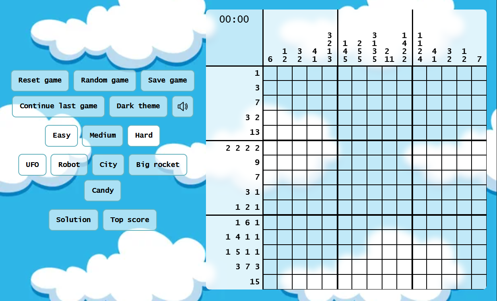
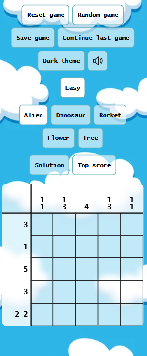
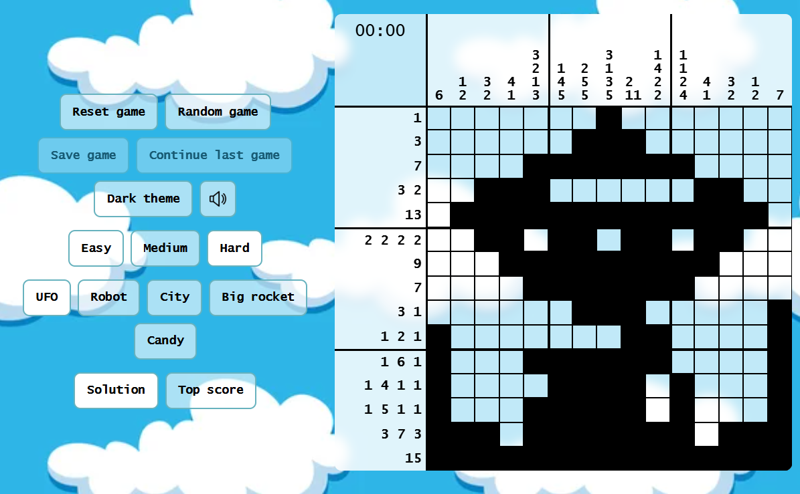

Nonograms is a logic puzzle with simple rules and challenging solutions.

The rules are simple.
You have a grid of squares, which must be either filled in black or marked with X. Beside each row of the grid are listed the lengths of the runs of black squares on that row. Above each column are listed the lengths of the runs of black squares in that column. Your aim is to find all black squares.
Left click on a square to make it black. Right click to mark with X. Click and drag to mark more than one square.

